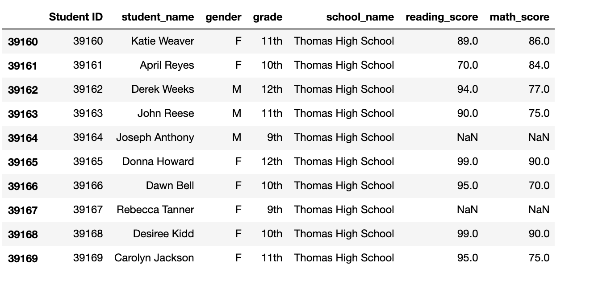
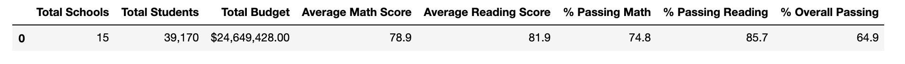
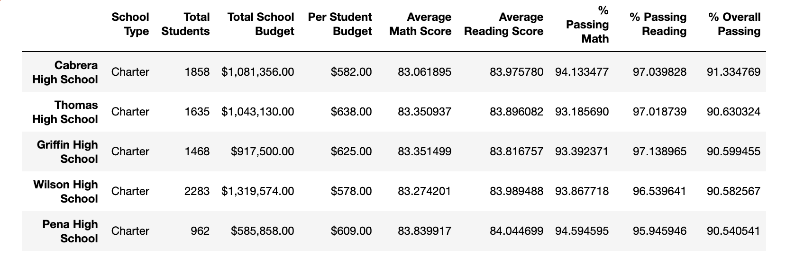
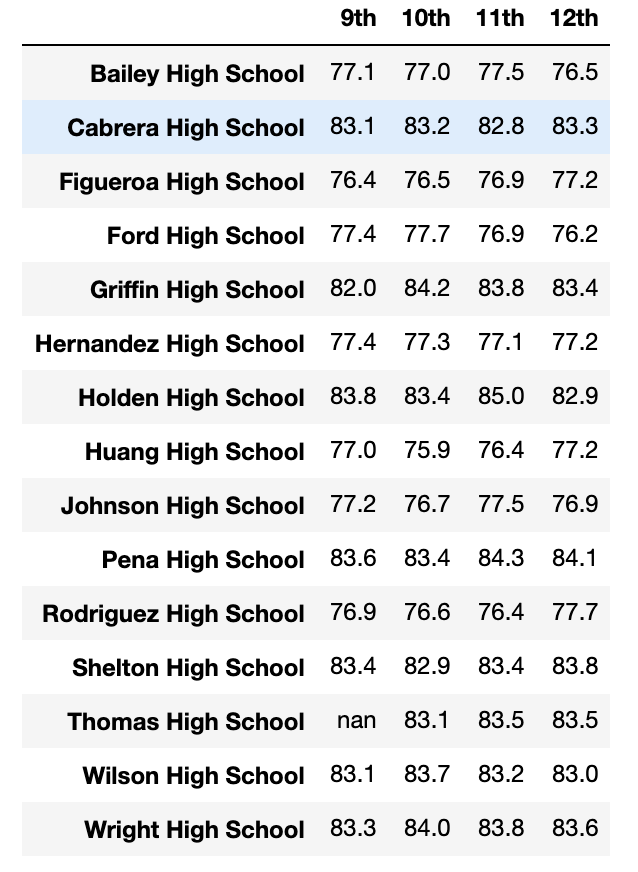
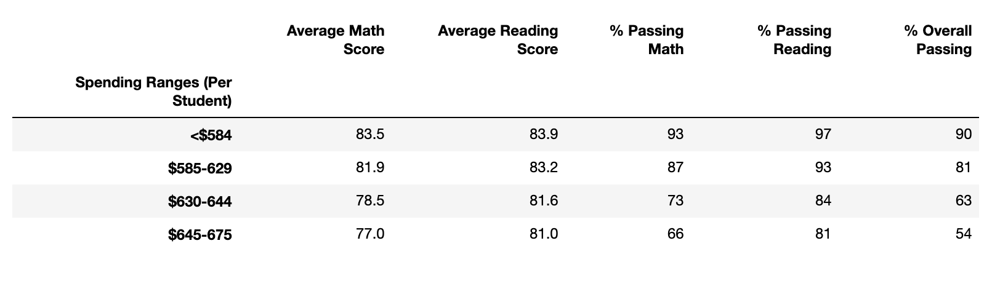
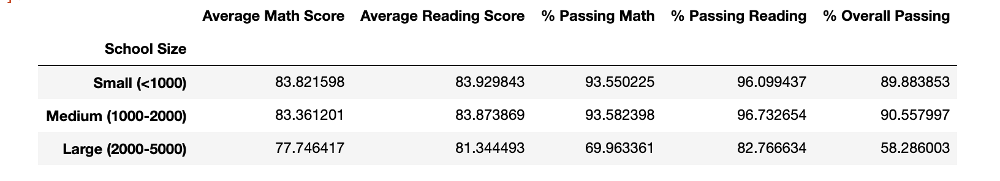
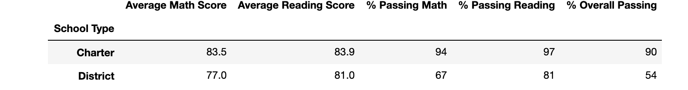

# School_District_Analysis

**School district analysis with pandas.**

## Overview of the school district analysis:

This study was conducted on city schools to get an overview of how the city school students were performing in math and reading. This report gave an in depth picture to the school board of all the students with their names and gender from 9th grade to 12th grade and their percentage scores in maths, reading and overall passing percentage from all the 15 schools. This report also shares information on the total budget and per student capita from each schools. The school board also gets an in sight into how the District schools performed in comparison to the Charter schools.

### The purpose of this analysis:

The school board on receiving the initial report noticed academic dishonesty in the reading and math scores from Thomas High School. They decided to probe more into this matter and till then uphold the state testing standards. In this new task, we are asked to replace the Math and reading scores of the Thomas High School 9th graders and run the school district analysis. This new report has the district summary, School summary , the top 5 and bottom 5 performing schools. Performance of each school based on school spendings and performance based on school size and school types. 

## Results of the school district analysis:

To start with the analysis, firstly the 9th grade scores were replaced with NaN using the loc function. This was followed by various functions that resulted in outputs that helped to provide insight into the data structure after the 9th graders from Thomas High School were replaced.

### 1. How is the district summary affected?

After removing the 9th grade scores from Thomas High school, the overall passing percentage dropped from 65.17% to 64.9%. The math and reading passing percentage did not change much.

### 2. How does replacing the ninth graders’ math and reading scores affect Thomas High School’s performance relative to the 			   other schools?

Thomas High School still remains in the top 5 performing schools after replacing the 9th grade scores, with an overall passing percentage of 90.63%. The math and reading passing percentage are 93.18% and 97.01% respectively.
	
### 3. How does replacing the ninth-grade scores affect the following:

#### Math and reading scores by grade

Thomas High School math grades for 10th, 11th and 12th are  83.1, 83.5 and 83.5. 
Thomas High school reading grades for reading for 10th, 11th and 12th grades are 84.3, 83.6 and 83.8.
Overall there is not much change in grades.
	
#### Scores by school spending

No change is seen in the reading math and overall passing percentage in the spending ranges per student.

#### Scores by school size

No change is observed on the Average scores and percent scores based in school size when the 9th grade scores are removed.

#### Scores by school type

Charter schools fared much better than the district schools in Average math and reading scores. The percentage scores in math and reading were also better win the Charter schools. The overall passing percentage in Charter school is higher with a whooping 90% as compared to a 54%

## Summary:

In conclusion, we can state that after removing the 9th grade scores from Thomas High School, Thomas High School was still in the top 5 of the best performing schools. Thomas High School being a charter school, overall fared much better than the district schools. However, there was an increase in math, reading and overall passing percentage after replacing the 9th grade scores. After analyzing the number of students in 9th, 10th, 11th and 12th grades we can see that the number of students in 9th grade is 461 as compared to 421 in 10th grade, 415 in 11th grade and 338 in 12th grade. Since we removed the 9th grade students the overall passing percentage increased for the other grades.

